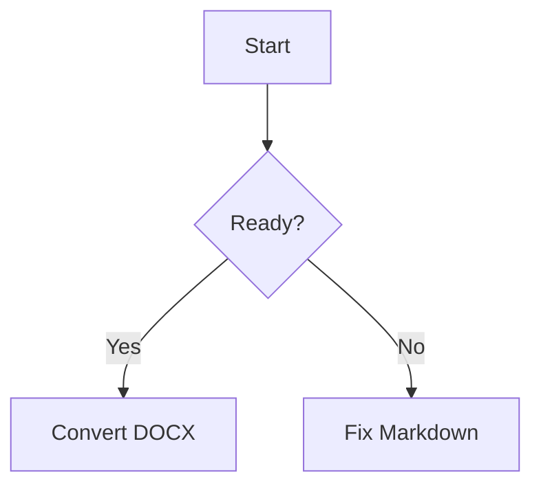

# Markdown To DOCX

## Overview

Convert Markdown to DOCX with Pandoc as the source of truth. Prefer the bundled wrapper so input validation, output naming, Pandoc installation, code highlighting, Mermaid flow chart rendering, reference-doc handling, and conversion errors are consistent.

## Workflow

1. Identify the input Markdown file and target `.docx` path.
2. If the user provides Markdown text instead of a file, write it to a temporary `.md` file in the working area for the task.
3. If the user provides a style/template DOCX, pass it as `--reference-docx`.
4. Run `scripts/convert_markdown_to_docx.py` from this skill.
5. Use fenced code blocks for code and curl snippets.
6. Use fenced `mermaid` blocks for flow charts; the wrapper renders them to images before Pandoc runs.
7. Let the wrapper install Pandoc automatically if it is missing.
8. Verify the command exits successfully and the output `.docx` exists.

## Convert

Use the wrapper:

```bash
python3 /path/to/markdown-to-docx/scripts/convert_markdown_to_docx.py INPUT.md OUTPUT.docx
```

With a reference DOCX:

```bash
python3 /path/to/markdown-to-docx/scripts/convert_markdown_to_docx.py INPUT.md OUTPUT.docx --reference-docx TEMPLATE.docx
```

With Pandoc standalone mode:

```bash
python3 /path/to/markdown-to-docx/scripts/convert_markdown_to_docx.py INPUT.md OUTPUT.docx --standalone
```

With code highlighting style:

```bash
python3 /path/to/markdown-to-docx/scripts/convert_markdown_to_docx.py INPUT.md OUTPUT.docx --highlight-style tango
```

Skip auto-install only when the environment must not change:

```bash
python3 /path/to/markdown-to-docx/scripts/convert_markdown_to_docx.py INPUT.md OUTPUT.docx --no-install
```

Skip Mermaid rendering only when the user wants flow charts to remain as code blocks:

```bash
python3 /path/to/markdown-to-docx/scripts/convert_markdown_to_docx.py INPUT.md OUTPUT.docx --no-render-mermaid
```

## Markdown Patterns

Code block:

````markdown
```python
print("hello")
```
````

Curl snippet:

````markdown
```bash
curl -X POST https://api.example.com/items \
  -H "Content-Type: application/json" \
  -d '{"name":"demo"}'
```
````

Flow chart:

````markdown

````

## Pandoc Recipes

Use these wrapper options for common DOCX needs:

```bash
python3 /path/to/markdown-to-docx/scripts/convert_markdown_to_docx.py INPUT.md OUTPUT.docx --toc
```

```bash
python3 /path/to/markdown-to-docx/scripts/convert_markdown_to_docx.py INPUT.md OUTPUT.docx --number-sections
```

```bash
python3 /path/to/markdown-to-docx/scripts/convert_markdown_to_docx.py INPUT.md OUTPUT.docx --metadata title="Document Title"
```

```bash
python3 /path/to/markdown-to-docx/scripts/convert_markdown_to_docx.py INPUT.md OUTPUT.docx --resource-path ./docs --resource-path ./assets
```

Use direct Pandoc only when the wrapper does not expose the needed option:

```bash
pandoc INPUT.md -o OUTPUT.docx --reference-doc=TEMPLATE.docx --toc --number-sections
```

```bash
pandoc INPUT.md -o OUTPUT.docx --metadata title="Document Title" --resource-path=./docs:./assets
```

For more copy-ready Pandoc samples, read `references/pandoc-examples.md`.

## Guardrails

- Use the wrapper's built-in Pandoc installer when `pandoc` is missing.
- Let the wrapper render `mermaid` fences to images; Pandoc does not render Mermaid diagrams by itself.
- Use `bash` fences for curl commands so Pandoc can highlight them predictably.
- Do not silently fall back to a hand-written DOCX parser.
- Keep the Markdown source as the editable source of truth unless the user asks to modify the DOCX directly.
- Use `--reference-docx` only when the user provides a template or asks to preserve a Word style set.
- Do not invent a default template in this skill.
- Prefer wrapper flags for common Pandoc options; use direct `pandoc` commands for uncommon options only after explaining why.
- If Pandoc or Mermaid auto-install fails, report the wrapper's error and the package manager it attempted to use.

## Verification

- Confirm the output path ends in `.docx`.
- Confirm the output file exists after conversion.
- For styled conversions, open or inspect the generated DOCX when practical to verify the reference document affected the result.
