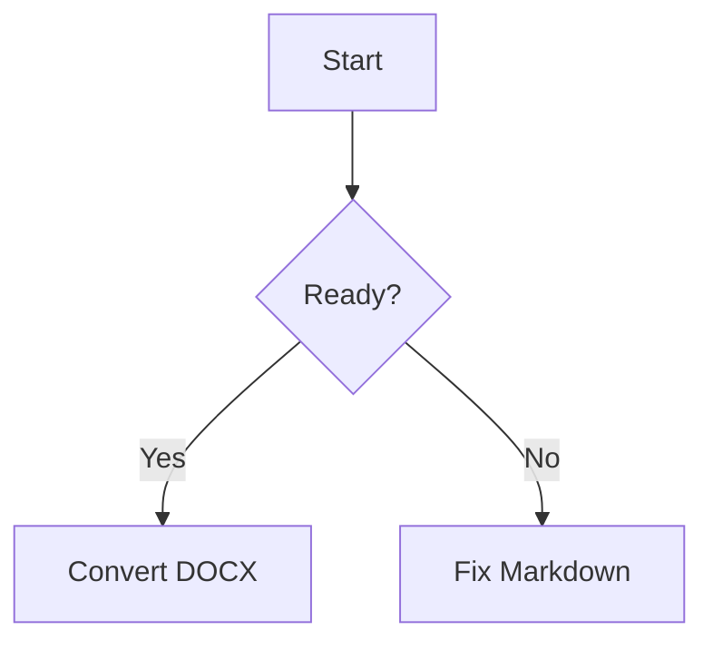

# Pandoc Examples For Markdown To DOCX

Use these examples when the wrapper is not enough or when the user asks for a concrete Pandoc command. Prefer the wrapper for routine conversion; use direct `pandoc` when an option is not exposed by the wrapper.

## Basic DOCX

```bash
pandoc input.md -o output.docx
```

## DOCX With Word Style Template

Use this when the user provides a `.docx` whose styles should control the output.

```bash
pandoc input.md -o output.docx --reference-doc=template.docx
```

## Table Of Contents

```bash
pandoc input.md -o output.docx --toc
```

## Numbered Sections

```bash
pandoc input.md -o output.docx --number-sections
```

## Title And Author Metadata

```bash
pandoc input.md -o output.docx --metadata title="Project Brief" --metadata author="Team"
```

## Images In Nearby Folders

Use `--resource-path` when Markdown references images with relative paths.

```bash
pandoc input.md -o output.docx --resource-path=.:./docs:./assets
```

## Multiple Markdown Files

Pandoc concatenates inputs in the order listed.

```bash
pandoc intro.md body.md appendix.md -o output.docx
```

## GitHub-Flavored Markdown

Use this when tables, task lists, or GFM-style Markdown are expected.

```bash
pandoc input.md -f gfm -o output.docx
```

## Code Blocks With Highlighting

Use fenced code blocks in Markdown and choose a Pandoc highlight style.

````markdown
```javascript
const message = "hello";
console.log(message);
```
````

```bash
pandoc input.md -f gfm -o output.docx --syntax-highlighting=tango
```

## Curl Snippets

Use `bash` fences for curl snippets so the command highlights well in DOCX.

````markdown
```bash
curl -X POST https://api.example.com/items \
  -H "Authorization: Bearer $TOKEN" \
  -H "Content-Type: application/json" \
  -d '{"name":"demo"}'
```
````

```bash
pandoc input.md -f gfm -o output.docx --syntax-highlighting=tango
```

## Mermaid Flow Charts

Pandoc does not render Mermaid diagrams by itself. Use the wrapper so `mermaid` fences are rendered to PNG before Pandoc creates the DOCX.

````markdown

````

```bash
python3 scripts/convert_markdown_to_docx.py input.md output.docx
```

## Preserve Line Breaks

Use this when soft line breaks in Markdown should become line breaks in DOCX.

```bash
pandoc input.md -o output.docx --wrap=preserve
```

## Shift Heading Levels

Use this when Markdown headings are one level too high or too low for the final document.

```bash
pandoc input.md -o output.docx --shift-heading-level-by=1
```

## Custom Highlight Style For Code Blocks

```bash
pandoc input.md -o output.docx --syntax-highlighting=tango
```

## Read Markdown From Stdin

Useful for quick one-off conversion from generated text.

```bash
printf '# Title\n\nBody text.\n' | pandoc -f markdown -o output.docx
```

## Common Full Command

```bash
pandoc input.md -f gfm -o output.docx --reference-doc=template.docx --toc --number-sections --metadata title="Project Brief" --resource-path=.:./assets
```
